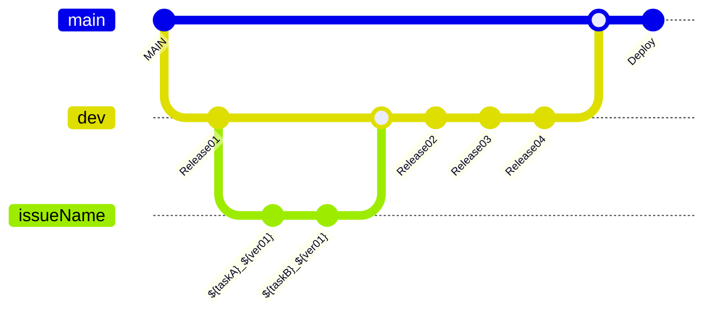

# Zeno


## 프로젝트 소개
> 그룹 내 좋아하는 사람에게 자신의 감정을 표현하기 어려운 소극적인 성격을 가진 사람을 위한 익명 마음 표현 창구 서비스
> > 시연 영상 : https://www.youtube.com/watch?v=j-ts8wLkrUE


### 💫주요 기능
- **`홈`** 그룹 목록 및 알림을 확인하고, 제노를 보낸 상대방의 초성을 확인할 수 있습니다.
- **`제노`** 참여한 그룹을 선택하여 마음을 전하고 싶은 상대에게 제노를 보낼 수 있습니다.
- **`그룹`** 그룹을 생성하고 참여할 수 있으며, 제노할 친구를 추가할 수 있습니다.
- **`마이페이지`** 친구 목록을 확인하고, 제노를 통해 획득한 뱃지를 확인할 수 있습니다.

### 📱구동화면
|`로그인 및 회원가입`|`온보딩`|`그룹 생성`|`카카오톡 친구초대`|`그룹 검색`|
|-------|-------|-------|-------|-------|
|||| ||

|`제노`|`푸쉬 알람`|`초성 확인`|`인앱결제`|`마이페이지`|
|:----:|:----:|:-----:|:----:|:-----:|
||||||

<br>


## ⚒️ How to build

### 설치 / 실행 방법 / 사용자 매뉴얼

* 아래 파일은 필수 파일으로 rawgmuker@naver.com 에 파일을 요청해주세요. 
```
- Secrets.xcconfig          // KakaoSDK
- GoogleService-Info.plist  // Firebase
```

<br>

<details>
<summary> 설치 및 실행 방법  </summary>
<div markdown="1">

    노션 링크 추후 공개

</div>
</details>

<details>
<summary> 사용자 매뉴얼  </summary>
<div markdown="1">

[ZENO_iOS_v1.0.pdf](https://github.com/APPSCHOOL3-iOS/final-zeno/files/13111810/ZENO_iOS_v1.0.pdf)

</div>
</details>


### 💻 개발 환경, 도구 및 활용한 기술
```
- 개발 언어 : Swift
- 개발 환경 : SwiftUI, Swift 5.8.1
    - 최소 iOS 16.4
    - iPhone SE ~ iPhone 15 Pro 호환
    - 다크모드 지원
    - 가로모드 미지원
- 디자인 툴 : Figma
- 협업 도구 : Github, Team Notion
- 활용한 기술
    - Xcode, Tuist, SwiftLint
    - KakaoSDKAuth
    - FirebaseAuth, FiresStore, Firebase Storage, Firebase Message
    - KingFisher, Lottie, ConfettiSwiftUI
```
<br>

### 컨벤션 및 깃플로우 전략
#### 폴더 컨벤션
```
📦Zeno
├── 🗂️Tuist
└── 🗂️Zeno
    ├── 🗂️Resources
    ├── 🗂️Sources
    │   ├── 🗂️KakaoLogin
    │   ├── 🗂️Model
    │   ├── 🗂️Protocol
    │   ├── 🗂️Repository
    │   ├── 🗂️Services
    │   ├── 🗂️Utils
    │   │   ├── Extension
    │   │   ├── Lottie
    │   │   └── ViewModifier
    │   ├── 🗂️View
    │   │   ├── Alarm
    │   │   ├── App
    │   │   ├── Common
    │   │   ├── Community
    │   │   ├── InAppPurchase
    │   │   ├── Login
    │   │   ├── MyPage
    │   │   ├── Story
    │   │   ├── Tab
    │   │   └── Zeno
    │   └── 🗂️ViewModel
    └── Zeno.entitlements
```


#### 깃플로우 전략


<br>

### 팀원 소개
<div align="center">

|[ 원강묵 ]<br/> [@MUKER-WON](https://github.com/MUKER-WON)<br/> "신생 젊은이 --> 갓생 젊은이" | [ 김건섭 ]<br/> [@gnksbm](https://github.com/gnksbm)<br/> "안드로이드?<br/> 그거 먹는 건가요?" | [ 박서연 ]<br/> [@syss220211](https://github.com/syss220211)<br/> "안녕하세요?<br/> 찐젊은이입니다 😎" | [ 신우진 ]<br/>[@swjtwin](https://github.com/swjtwin)<br/> "깡과 총이있어<br/> 강한 개발자 입니다."  |
| :----------------------------------------------------------: | :---------------------------------------------: | :------: | :-------------------------------------------------: |
| |  |   |  |


| [ 안효명 ]<br/>[@licors](https://github.com/licors)<br/> "한줄소개 꼭 써야합니까" |[ 유하은 ]<br/> [@yuhaeun-la](https://github.com/yuhaeun-la)<br/> "제노 개발자"  |  [ 함지수 ]<br/> [@isakatty](https://github.com/isakatty)<br/> "다 울었니 ? 이제 할 일을 하자" |
|:-----------------------------------------------------------: | :-----------------------------------------------------------: | :-----------------------------------------------------------: | 
| |  | |

</div>
 

<br>

## 📄 License
### “Zeno" is available under the MIT license. See the [LICENSE](https://github.com/APPSCHOOL3-iOS/final-zeno/blob/main/LICENSE) file for more info.
- Tuist
- Firebase - iOS
- KakaoSDK - iOS
- Lottie - iOS
- KingFisher
- ConfettiSwiftUI

<br />
